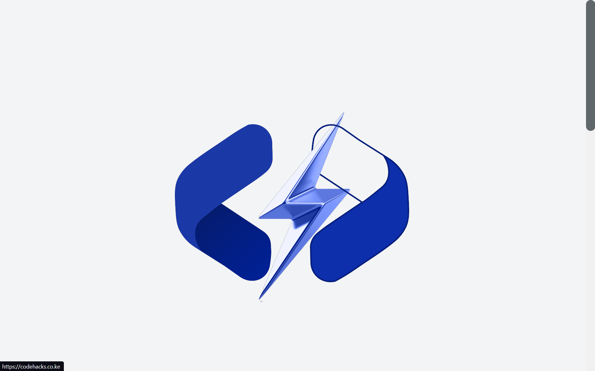

# CodeHacks Web Programming Course

This repository contains comprehensive planning resources for a web programming course offered by CodeHacks. The course covers a wide range of topics including setting up a web project, working with APIs, data processing, and monetizing web programming skills.

## Course Outline

1. Setting up a Web Project || [View 🔥](1.Setting%20up%20a%20web%20project/index.md)
2. Frontend Development || [View 🔥](2.Frontend%20Development/index.md)
3. Backend Development || [View 🔥](3.Backend%20Development/index.md)
4. APIs || [View 🔥](4.APIs/index.md)
5. Data Processing || [View 🔥](5.Data%20Processing/index.md)
6. Deploying and Maintaining a Web Application || [View 🔥](6.Deploying%20and%20Maintaining%20a%20Web%20Application/index.md)
7. Monetizing Web Programming Skills || [View 🔥](7.Monetizing%20Web%20Programming%20Skills/index.md)

## Repository Structure

This repository is organized into different folders, each corresponding to a topic in the course outline. Each folder contains relevant resources such as outlines, learning objectives, and project ideas.

## Contributing

We welcome contributions from the community. If you have any suggestions or improvements, feel free to open an issue or submit a pull request.

## About CodeHacks

CodeHacks is a leading provider of programming courses. We believe in hands-on learning and our courses are designed to provide practical skills to our students.
Check out our website at [codehacks](https://codehacks.co.ke) for more information.

## Contact

For any queries, feel free to reach out to us at [contact@codehacks.com](mailto:tomsteve187@gmail.com).